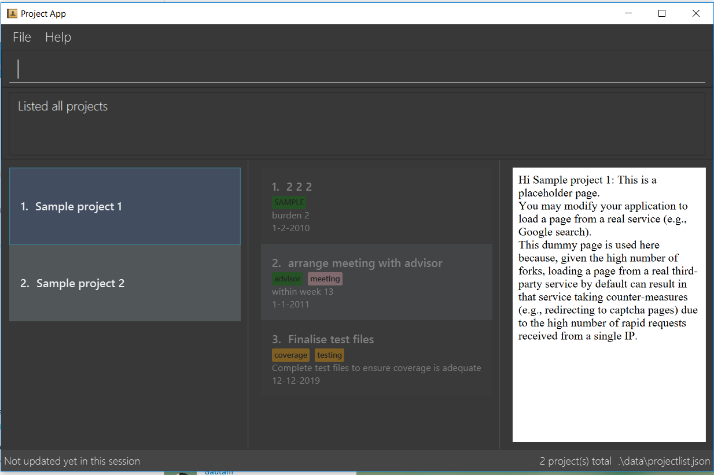

= NoteNote
ifdef::env-github,env-browser[:relfileprefix: docs/]

https://travis-ci.org/CS2113-AY1819S2-T09-3/main[image:https://travis-ci.org/CS2113-AY1819S2-T09-3/main.svg?branch=master[Build Status]]

ifdef::env-github[]

endif::[]

ifndef::env-github[]
image::images/Ui.png[width="600"]
endif::[]

* This is a desktop task management application for Computing students who need to manage multiple projects simultaneously.

* Aiming to reach to the height where users can manage projects faster than a GUI-driven application, this application is suitable for users who would like to be / are reasonably comfortable with using CLI apps

== Site Map

* <<UserGuide#, User Guide>>
* <<DeveloperGuide#, Developer Guide>>
* <<AboutUs#, About Us>>
* <<ContactUs#, Contact Us>>

== Acknowledgements

* Some parts of this sample application were inspired by the excellent http://code.makery.ch/library/javafx-8-tutorial/[Java FX tutorial] by
_Marco Jakob_.
* Libraries used: https://github.com/TestFX/TestFX[TextFX], https://github.com/FasterXML/jackson[Jackson], https://github.com/google/guava[Guava], https://github.com/junit-team/junit5[JUnit5]

* This application was built using the source code found in https://github.com/se-edu/addressbook-level4[AddressBook-level4] by SE-EDU.

== Licence : link:LICENSE[MIT]
